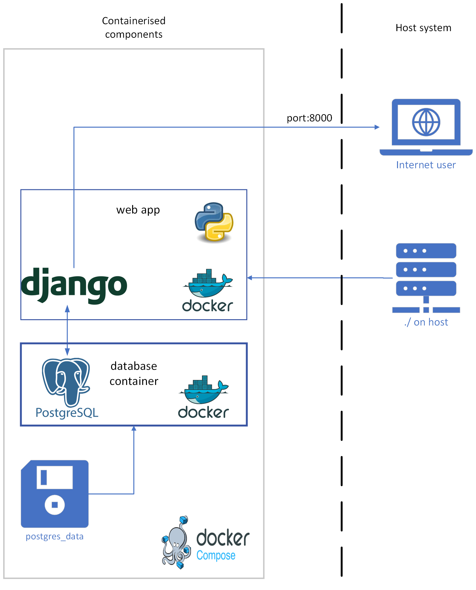

Development Deployment
======================

The development environment is a simplified version of the production environment and is intended to be run and accessed only from your local machine. 
docker-compose.yml includes multiple containers for web application, test-api and prop-api and their respective databases.

Project Structure
-----------------

Docker Containers
-----------------

- Web Container: Hosts the Django web application (web).
- Database Container: Runs PostgreSQL to manage the application's database(db).
- Test-API Container: Runs the test-api (test-api).
- Test-Database Container: Runs PostgreSQL to manage the test-api's database(db-test-api).
- Prop-API Container: Runs the prop-api (prop-api).
- Prop-Database Container: Runs PostgreSQL to manage the prop-api's database(db-api).

docker-compose.yml
^^^^^^^^^^^^^^^^^^

.. code-block:: yaml

  services:
    db:
      image: postgres:15.8
      container_name: db-container
      volumes:
        - postgres_data:/var/lib/postgresql/data/
      env_file:
        - .env_web
      # ports:
      #   - 5432:5432
      networks:
        - tracet-network
      healthcheck:
        test: ["CMD-SHELL", "pg_isready -d $${POSTGRES_DB} -U $${POSTGRES_USER}"]
        interval: 10s
        retries: 5
        start_period: 30s
        timeout: 5s

    db-api:
      image: postgres:15.8
      container_name: db-api-container
      volumes:
        - postgres_api:/var/lib/postgresql/data/
      env_file:
        - .env_api
      # ports:
      #   - 5431:5432
      networks:
        - tracet-network
      healthcheck:
        test: ["CMD-SHELL", "pg_isready -d $${POSTGRES_DB} -U $${POSTGRES_USER}"]
        interval: 10s
        retries: 5
        start_period: 30s
        timeout: 5s

    db-test-api:
      image: postgres:15.8
      container_name: db-test-api-container
      volumes:
        - postgres_test_api:/var/lib/postgresql/data/
      env_file:
        - .env_test
      # ports:
      #   - 5430:5432
      networks:
        - tracet-network
      healthcheck:
        test: ["CMD-SHELL", "pg_isready -d $${POSTGRES_DB} -U $${POSTGRES_USER}"]
        interval: 10s
        retries: 5
        start_period: 30s
        timeout: 5s

    prop-api:
      build:
        context: ./prop_api/
        dockerfile: Dockerfile
        args:
          SYSTEM_ENV: DEVELOPMENT
      container_name: api-container
      privileged: true
      # restart: always
      volumes:
        - ./prop_api:/app:rw
      ports:
        - "8001:8000"
      env_file:
        - .env_api
      command:
        [
          "sh",
          "-c",
          "python manage.py migrate &&
          python manage.py runserver 0.0.0.0:8000",
        ]
      depends_on:
        db-api:
          condition: service_healthy
      networks:
        - tracet-network
      healthcheck:
        test: ["CMD", "curl", "-f", "http://localhost:8000/api/health"]
        interval: 30s
        timeout: 10s
        retries: 3

    web:
      build:
        context: ./webapp_tracet/
        dockerfile: Dockerfile
        args:
          SYSTEM_ENV: DEVELOPMENT
      container_name: web-container
      privileged: true
      # restart: always
      volumes:
        - ./webapp_tracet:/app
      ports:
        - "8000:8000"
      env_file:
        - .env_web
      # command: ["sh", "-c", "python manage.py runserver 0.0.0.0:8000"]
      command: [
          "sh",
          "-c",
          "python manage.py runserver 0.0.0.0:8000 & sleep 5s && echo 'Starting'
          && tmux new -s kafka -d './kafka_daemon.sh'
          && tmux new -s comet -d 'python3.10 twistd_comet_wrapper.py' && wait",
      ]
      depends_on:
        db:
          condition: service_healthy
        prop-api:
          condition: service_healthy
      networks:
        - tracet-network

    test-api:
      build:
        context: ./test_api/
        dockerfile: Dockerfile
        args:
          SYSTEM_ENV: DEVELOPMENT
      container_name: test-api-container
      privileged: true
      # restart: always
      volumes:
        - ./test_api:/app:rw
      ports:
        - "8002:8000"
      env_file:
        - .env_test
      command:
        [
          "sh",
          "-c",
          "python manage.py migrate &&
          python manage.py runserver 0.0.0.0:8000",
        ]
      depends_on:
        db-test-api:
          condition: service_healthy
      networks:
        - tracet-network

  volumes:
    postgres_data:
    postgres_api:
    postgres_test_api:

  networks:
    tracet-network:
      driver: bridge
      # internal: true

Docker files
--------------------

The Docker files for the web application, test-api and prop-api are located in the root directory of the project.
As example, the Dockerfile for the web application is shown below:

Dockerfile
^^^^^^^^^^

.. code-block:: dockerfile
  
  # Use an official Python runtime as a parent image
  FROM python:3.10-slim

  WORKDIR /app
  # Install git
  RUN apt-get update && \
      apt-get install -y git && \
      apt-get install -y iptables && \
      apt-get install -y curl && \
      apt-get install -y dnsutils && \
      apt-get install -y build-essential libpq-dev gcc && \
      apt-get install -y tmux && \
      apt-get install -y librdkafka++1 librdkafka-dev librdkafka1 && \ 
      apt-get install -y libsasl2-modules-gssapi-mit

  # Update alternatives to make iptables-legacy the default
  RUN update-alternatives --set iptables /usr/sbin/iptables-legacy \
      && update-alternatives --set ip6tables /usr/sbin/ip6tables-legacy

  # create the appropriate directories
  # ENV HOME=/app
  # ENV APP_HOME=/app/webapp_tracet

  # Install tracet dependencies
  COPY tracet_package/requirements.txt /app/

  RUN pip install --upgrade pip
  RUN pip install -r requirements.txt

  COPY requirements_web.txt /app/
  RUN pip install -r requirements_web.txt

  WORKDIR /app/tracet_package
  ADD tracet_package /app/tracet_package 
  RUN pip install .

  WORKDIR /app
  COPY webapp_tracet /app/webapp_tracet
  COPY trigger_app /app/trigger_app

  ARG SYSTEM_ENV
  # Set the environment variable
  ENV SYSTEM_ENV=${SYSTEM_ENV}

  #ADD webapp_tracet /app/webapp_tracet
  WORKDIR /app
  # Collect static files

  # Add this command to conditionally run collectstatic
  RUN if [ "$SYSTEM_ENV" = "PRODUCTION" ]; then \
      python manage.py collectstatic --noinput; \
      fi

  EXPOSE 8000
  CMD [ "/bin/bash" ]

Instructions
------------

.. code-block:: instructions

  docker-compose build  - to build the images
  docker-compose up -d  - to run the containers in detached mode
  docker-compose down   - to stop the containers

After building and running the containers first time, you have to update the database. When you have existing data, you have to upload the data to the web application database(container db).

.. code-block:: instructions

  mkdir prop_api/logs

  docker cp demo_trigger_db.sql db-container:/
  docker exec -it db-container bash -c "PGPASSWORD=mwatriggerbowtie22 psql -U trigger_admin -d trigger_db -f /demo_trigger_db.sql"

Then, you can can restart docker-compose again. Also, you can create superuser for the web application:

.. code-block:: instructions

  docker exec -it web-container bash -c "python manage.py createsuperuser"

Advantages of Dockerization
---------------------------

Consistency Across Environments
^^^^^^^^^^^^^^^^^^^^^^^^^^^^^^^

- Uniform Development and Production: Docker ensures that the application behaves the same way in development, testing, and production environments.
- Separate Containers: Each component (web app, database) runs in its own container, which isolates dependencies and avoids conflicts.
- Simplified Configuration: Docker Compose simplifies the process of configuring and starting multiple services with a single command.
- Cross-Platform Compatibility: Docker containers run consistently across different operating systems (Windows, Linux, macOS).
- Easy Scaling: Docker allows you to scale services up or down easily by modifying the Docker Compose configuration.
- Version Control: Docker images are versioned, making it easy to reproduce environments or roll back to previous versions.
- Resource Management: Docker containers share the host OS kernel, which makes them lightweight compared to virtual machines.

Running Docker on Different Platforms
-------------------------------------

- Windows: Use Docker Desktop for Windows. It provides an easy-to-use interface and integrates with WSL 2 for a more native Linux experience.
- Linux: Install Docker Engine and Docker Compose directly from your package manager. Follow the official Docker documentation for installation instructions.
- macOS: Use Docker Desktop for Mac. It includes a graphical interface and manages Docker containers with minimal setup.

Additional Features and Best Practices
--------------------------------------

- Health Checks: Implement health checks for your services to ensure they are running correctly.
- Backup Strategies: Plan and implement regular backups for your database data.
- Environment Variables: Use environment variables to manage configuration settings and secrets securely.
- Logging: Configure logging for both the web application and database to capture and analyze logs efficiently.
