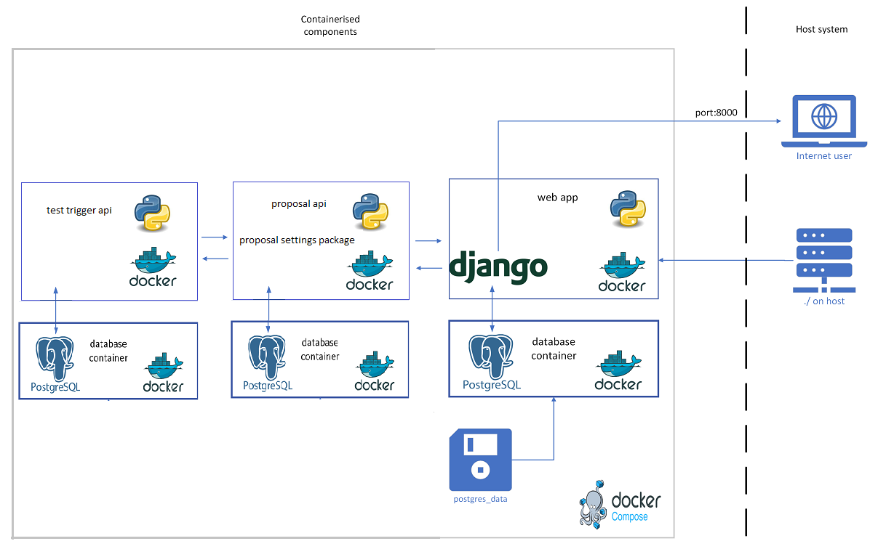

Development Deployment
======================

The development environment is a simplified version of the production environment and is intended to be run and accessed only from your local machine. 
docker-compose.yml includes multiple containers for web application, test-api and prop-api and their respective databases.

Project Structure
-----------------

Docker Containers
-----------------

- Web Container: Hosts the Django web application (web).
- Database Container: Runs PostgreSQL to manage the application's database(db).
- Test-API Container: Runs the test-api (test-api).
- Test-Database Container: Runs PostgreSQL to manage the test-api's database(db-test-api).
- Prop-API Container: Runs the prop-api (prop-api).
- Prop-Database Container: Runs PostgreSQL to manage the prop-api's database(db-api).

docker-compose.yml
^^^^^^^^^^^^^^^^^^

.. code-block:: yaml

  services:
    db:
      image: postgres:15.8
      container_name: db-container
      volumes:
        - postgres_data:/var/lib/postgresql/data/
      env_file:
        - .env_web
      # ports:
      #   - 5432:5432
      networks:
        - tracet-network
      healthcheck:
        test: ["CMD-SHELL", "pg_isready -d $${POSTGRES_DB} -U $${POSTGRES_USER}"]
        interval: 10s
        retries: 5
        start_period: 30s
        timeout: 5s

    db-api:
      image: postgres:15.8
      container_name: db-api-container
      volumes:
        - postgres_api:/var/lib/postgresql/data/
      env_file:
        - .env_api
      # ports:
      #   - 5431:5432
      networks:
        - tracet-network
      healthcheck:
        test: ["CMD-SHELL", "pg_isready -d $${POSTGRES_DB} -U $${POSTGRES_USER}"]
        interval: 10s
        retries: 5
        start_period: 30s
        timeout: 5s

    db-test-api:
      image: postgres:15.8
      container_name: db-test-api-container
      volumes:
        - postgres_test_api:/var/lib/postgresql/data/
      env_file:
        - .env_test
      # ports:
      #   - 5430:5432
      networks:
        - tracet-network
      healthcheck:
        test: ["CMD-SHELL", "pg_isready -d $${POSTGRES_DB} -U $${POSTGRES_USER}"]
        interval: 10s
        retries: 5
        start_period: 30s
        timeout: 5s

    prop-api:
      build:
        context: ./prop_api/
        dockerfile: Dockerfile
        args:
          SYSTEM_ENV: DEVELOPMENT
      container_name: api-container
      privileged: true
      # restart: always
      volumes:
        - ./prop_api:/app:rw
      ports:
        - "8001:8000"
      env_file:
        - .env_api
      command:
        [
          "sh",
          "-c",
          "python manage.py migrate &&
          python manage.py runserver 0.0.0.0:8000",
        ]
      depends_on:
        db-api:
          condition: service_healthy
      networks:
        - tracet-network
      healthcheck:
        test: ["CMD", "curl", "-f", "http://localhost:8000/api/health"]
        interval: 30s
        timeout: 10s
        retries: 3

    web:
      build:
        context: ./webapp_tracet/
        dockerfile: Dockerfile
        args:
          SYSTEM_ENV: DEVELOPMENT
      container_name: web-container
      privileged: true
      # restart: always
      volumes:
        - ./webapp_tracet:/app
      ports:
        - "8000:8000"
      env_file:
        - .env_web
      # command: ["sh", "-c", "python manage.py runserver 0.0.0.0:8000"]
      command: [
          "sh",
          "-c",
          "python manage.py runserver 0.0.0.0:8000 & sleep 5s && echo 'Starting'
          && tmux new -s kafka -d './kafka_daemon.sh'
          && tmux new -s comet -d 'python3.10 twistd_comet_wrapper.py' && wait",
      ]
      depends_on:
        db:
          condition: service_healthy
        prop-api:
          condition: service_healthy
      networks:
        - tracet-network

    test-api:
      build:
        context: ./test_api/
        dockerfile: Dockerfile
        args:
          SYSTEM_ENV: DEVELOPMENT
      container_name: test-api-container
      privileged: true
      # restart: always
      volumes:
        - ./test_api:/app:rw
      ports:
        - "8002:8000"
      env_file:
        - .env_test
      command:
        [
          "sh",
          "-c",
          "python manage.py migrate &&
          python manage.py runserver 0.0.0.0:8000",
        ]
      depends_on:
        db-test-api:
          condition: service_healthy
      networks:
        - tracet-network

  volumes:
    postgres_data:
    postgres_api:
    postgres_test_api:

  networks:
    tracet-network:
      driver: bridge
      # internal: true

Docker files
--------------------

The Docker files for the web application, test-api and prop-api are located in the root directory of the project.
As example, the Dockerfile for the web application is shown below:

Dockerfile
^^^^^^^^^^

.. code-block:: dockerfile
  
  # Use an official Python runtime as a parent image
  FROM python:3.10-slim

  WORKDIR /app
  # Install git
  RUN apt-get update && \
      apt-get install -y git && \
      apt-get install -y iptables && \
      apt-get install -y curl && \
      apt-get install -y dnsutils && \
      apt-get install -y build-essential libpq-dev gcc && \
      apt-get install -y tmux && \
      apt-get install -y librdkafka++1 librdkafka-dev librdkafka1 && \ 
      apt-get install -y libsasl2-modules-gssapi-mit

  # Update alternatives to make iptables-legacy the default
  RUN update-alternatives --set iptables /usr/sbin/iptables-legacy \
      && update-alternatives --set ip6tables /usr/sbin/ip6tables-legacy

  # create the appropriate directories
  # ENV HOME=/app
  # ENV APP_HOME=/app/webapp_tracet

  # Install tracet dependencies
  COPY tracet_package/requirements.txt /app/

  RUN pip install --upgrade pip
  RUN pip install -r requirements.txt

  COPY requirements_web.txt /app/
  RUN pip install -r requirements_web.txt

  WORKDIR /app/tracet_package
  ADD tracet_package /app/tracet_package 
  RUN pip install .

  WORKDIR /app
  COPY webapp_tracet /app/webapp_tracet
  COPY trigger_app /app/trigger_app

  ARG SYSTEM_ENV
  # Set the environment variable
  ENV SYSTEM_ENV=${SYSTEM_ENV}

  #ADD webapp_tracet /app/webapp_tracet
  WORKDIR /app
  # Collect static files

  # Add this command to conditionally run collectstatic
  RUN if [ "$SYSTEM_ENV" = "PRODUCTION" ]; then \
      python manage.py collectstatic --noinput; \
      fi

  EXPOSE 8000
  CMD [ "/bin/bash" ]

Instructions
------------

To begin, build the images and run the containers by executing the ./docker-build.sh script. please copy env files(.env_web, .env_api, and .env_test) and demo_trigger_db.sql to the root directory of the project.
Ensure that the POSTGRES_PASSWORD parameter, used within docker-build.sh, is sourced from the .env_web file:

.. code-block:: instructions

  ./docker-build.sh

After building the images and running the containers first time, you can use the following commands to manage the containers:

.. code-block:: instructions

  docker-compose build  - to build the images
  docker-compose up -d  - to run the containers in detached mode
  docker-compose down   - to stop the containers

Afterward, you can create superusers for the web application (web-container), prop-api (api-container), and test-api (test-api-container) by running the following commands. 
Please use the username(AUTH_USERNAME) and password(AUTH_PASSWORD) as defined in the .env_web and .env_api files. The username and passwords are used in the api authentication.
Right now, the username and password are the same for all the superusers.

.. code-block:: instructions

  docker exec -it web-container bash -c "python manage.py createsuperuser"
  docker exec -it api-container bash -c "python manage.py createsuperuser"
  docker exec -it test-api-container bash -c "python manage.py createsuperuser"

To capture events via the VOEvent network and kafka you need two background services to run. We will run these in tmux.

.. code-block:: instructions

    command: [
        "sh",
        "-c",
        "python manage.py runserver 0.0.0.0:8000 & sleep 5s && echo 'Starting'
        && tmux new -s kafka -d './kafka_daemon.sh'
        && tmux new -s comet -d 'python3.10 twistd_comet_wrapper.py' && wait",
    ]

If you dont need to run the comet and kafka services, you can comment out the lines in the docker-compose.yml file and use the following command line.

.. code-block:: instructions

  command: ["sh", "-c", "python manage.py runserver 0.0.0.0:8000"]

