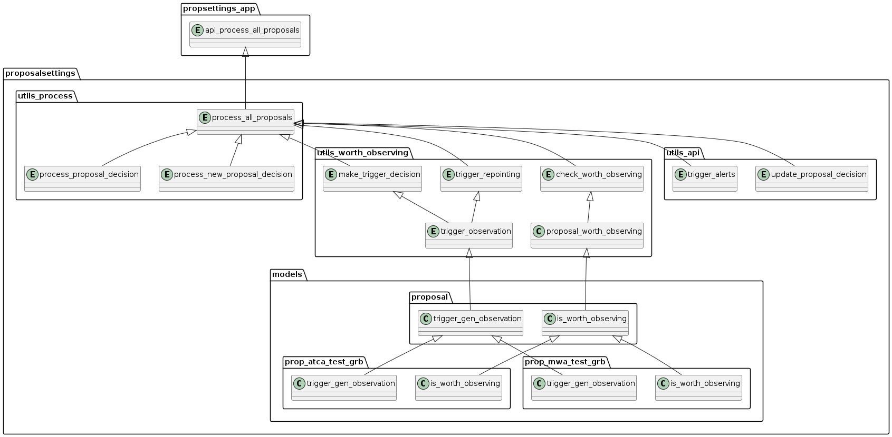

.. _overview:

Overview
========

Web App Event Processing Flow
----------------------------
The proposal settings module is the main module for creating new proposals. The web application has hold small table with few parameters for each proposal and cannot create new proposals. However, it updates the proposal settings table from the proposal API when docker containers start. If the existing proposal is deleted in the proposal settings module in proposal api, the proposal will get inactive status in the web application. The inactive proposal will not be used for creating new proposals.

Every time an event is added to the database, this signals the group_trigger function in webapp_tracet/trigger_app/signals.py. This will group events by their trig_id and then loop over the ProposalSettings model objects to see if any proposals want to observe this type of object. If event is new event, the event group is created and the event is added to it. The event group is then linked to the event. Also, the new proposal decisions are created. After this, the request is sent to the proposal API to process the event and proposals. Please read the `Event Processing Flow` in the web application documentation.

Proposal API Event Processing Flow
--------------------------------

The first function to be called on the proposal API side is api_process_all_proposals. This function is main api function that receives the data from the web app and calls main processing function process_all_proposals in webapp_tracet/trigger_app/utils/utils_signals.py.
The first function to be called is process_all_proposals. This function is main function that orchestrates the processing of all proposals or new proposals calling other functions to do the job. The following diagram shows the flow of functions.

The main logics are implemented in proposalsettings/models directory. Each proposal settings has own folder and main logics are implemented in the following functions:

- is_worth_observing
- trigger_gen_observation

The is_worth_observing function is used to determine if the source is worth observing. The trigger_gen_observation function holds the logic to trigger the observation and processing data before and after the observation. 

The telescope settings classes are implemented in telescopesettings.py. Currently, one base asbtract and two telescope settings classes are implemented:

- BaseTelescopeSettings
- MWATelescopeSettings
- ATCATelescopeSettings

You can add new telescope settings classes by adding new classes that inherit from the BaseTelescopeSettings. The telescope related functions are implemented in the classes.

