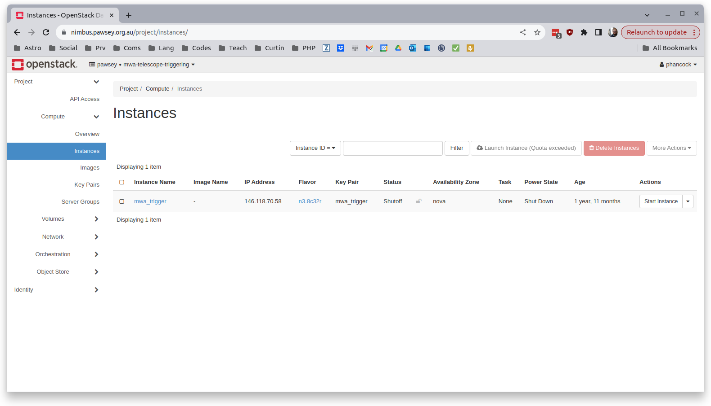

Restarting Nimbus Instance
==========================

If the nimbus instance is offline after a fault or regular pawsey maintenance, then you'll have to restart the instance.

Go to `https://nimbus.pawsey.org.au/`_, login, and then select the project that is running your service (e.g. "mwa-telescope-triggering" in the images below.)

Navigate to the "Compute/Instances" on the left panel, and you'll see that the Power State is either "Shut Down" or some such thing.

From the drop down on the right of the instance choose "Start Instance" and this will trigger the boot sequence.
Note that this can take some time to complete (longer than your desktop would take to boot).

To test if the instance is booted you can either just keep running ssh requests until it connects, or you can click the instance name ("mwa-trigger" in the above image) and then click the "console" or "log" tab.
When the instance is ready to accept connections you'll see a terminal login in the "console" tab.
You can't actually log in from here since we disabled password access, but you can ssh from your local machine.

Now that the Nimbus instance is up and running you'll need to restart the web-app.
See ref::`running_server`, and use the `restart-server.sh` script.
